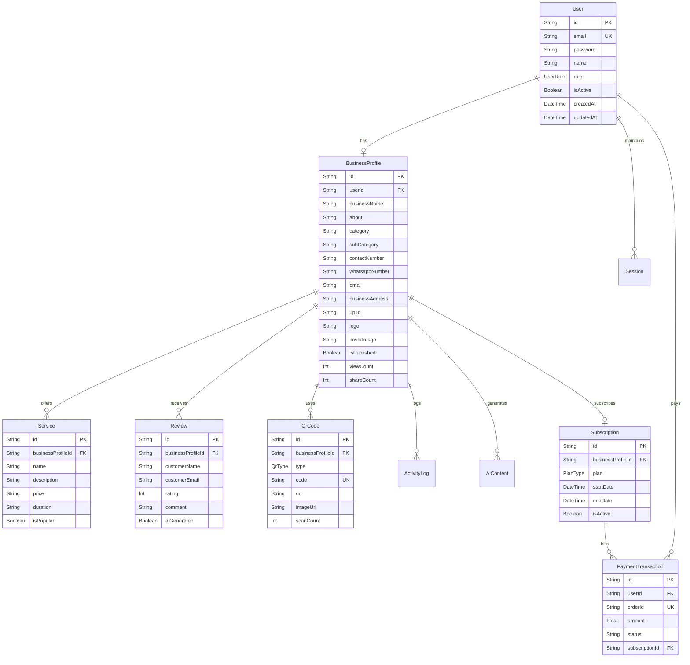

# Vscan (BizPresence) - Project Summary & Functionality

Welcome to **Vscan** (publicly branded as **BizPresence**), a premium, state-of-the-art SaaS web application engineered to empower local and small businesses in India with an instant, robust, and AI-driven digital footprint.

This document serves as the comprehensive source of truth for the project's architecture, database models, core capabilities, codebase structure, and execution steps.

---

## 📖 Project Overview & Target Audience

BizPresence is a **no-code digital presence builder** designed specifically for small business owners, micro-entrepreneurs, and freelancers (e.g., local kirana stores, salon owners, technicians, photographers, clinics, tutors, restaurants, and CA/law firms). 

Within 5 minutes, any business owner can establish a professional online presence without writing code or employing developers. The platform bundles a customizable mini-website, a digital business card, Dynamic QR codes, UPI payments, and AI-powered text generation.

---

## 🛠️ Modern Tech Stack

The application is built on a highly performant and responsive modern stack:

*   **Framework:** [Next.js 16](https://nextjs.org/) (utilizing React Pages Router for seamless server/client transitions and rapid routing).
*   **UI Library:** [React 19](https://react.dev/) & [HeroUI](https://heroui.com/) (`@heroui/react`) for accessible, rich, interactive web components.
*   **Styling:** [Tailwind CSS v4](https://tailwindcss.com/) + Vanilla CSS customization for sleek, dynamic glassmorphism and modern UI designs.
*   **Database & ORM:** [Prisma ORM](https://www.prisma.io/) with [PostgreSQL](https://www.postgresql.org/) database.
*   **Animations:** [Framer Motion](https://www.framer.com/motion/) for fluid transitions and micro-interactions.
*   **Icons:** [Lucide React](https://lucide.dev/) & [React Icons](https://react-icons.github.io/react-icons/) for sharp visual cues.
*   **Analytics / Charts:** [Recharts](https://recharts.org/) for real-time traffic and scan metrics.
*   **QR Generation:** `qrcode` library for dynamic QR code creation.
*   **Payments:** Integrated with [Cashfree Payments](https://www.cashfree.com/) for secure Indian payment gateways.

---

## 🌟 Core Features & Functionality

### 1. Mini Business Website Builder (`src/pages/app/mini-website.js`)
An interactive, side-by-side no-code editor that enables users to preview their mobile site in real-time as they toggle settings and configure sections:
*   **Templates & Themes:** Toggle between various premade design systems (e.g., `BusinessModern`, `BusinessMinimal`, `BusinessPremium`, `BusinessBold`, `BusinessCards`, and `BusinessNeo`) and custom color gradients.
*   **Dynamic Sections:** Modular control to show/hide specific website components:
    *   *Announcement Bar:* Catchy promotional banner alerts (e.g., special discounts).
    *   *Products & Services:* List items with price tags, descriptions, and optional cover photos.
    *   *Amenities:* Bulleted lists highlighting business traits (e.g., "Free Parking", "24/7 Support").
    *   *Business Hours:* Configure days, opening/closing hours, or "Closed" statuses.
    *   *Team Members:* Profiles of personnel, including bio details, designations, and contact info.
    *   *Customer Testimonials:* Star ratings (1-5) and written feedback.
    *   *Media/Video Showcase:* Direct embed links for YouTube videos.
    *   *Enquiry Form:* Google Form integration to capture custom inquiries.
    *   *Social Media Handles:* Quick-links to Instagram, Facebook, and YouTube channels.

### 2. Smart QR Code Management (`src/pages/app/smart-qr.js`)
Dynamically creates and links QR codes to multiple destinations under the verified business domain name:
*   **Smart Menu QR:** A single scan leads customers to a mobile portal displaying reviews, contact details, and the mini-website.
*   **Reviews QR:** Automatically redirects clients to the business's Google Review URL to boost search rankings.
*   **Contact Info QR:** Quick-adds the business contact information directly to the phone's native address book.
*   **Website QR:** Direct link to the mini-website profile page.
*   **Actions:** Users can generate, preview inside a mockup mobile viewport, copy links, download high-res QR images, or directly share them via the native web-sharing API.

### 3. AI SEO & Review Manager (`src/pages/app/ai-suggestions.js`)
Uses artificial intelligence to remove the friction of generating marketing copies:
*   **Keyword Optimization:** Configure up to 10 key search terms representing the business specialties.
*   **Review Cache Engine:** Pregenerates AI-modeled review templates in varied tones (professional, enthusiastic, casual) to let customers paste reviews with single-click ease.
*   **SEO Title & Descriptions:** Automatically generates meta-tags based on catalog content for indexing in search engines.

### 4. Performance Dashboard (`src/pages/app/dashboard.js`)
Tracks the digital performance of the business profiles in real-time:
*   **Financial Metrics:** Estimates total valuation generated through direct contact and review metrics.
*   **Interactive Traffic Graphs:** Custom Recharts line graph showing profile traffic trends across Today, 7 Days, 30 Days, or All-Time.
*   **Hourly Activity Heatmaps:** A 24-hour visual cell matrix depicting peak traffic periods to optimize operations.
*   **Daily Scan Logs & Customer Feedback:** Lists historical daily counts and private customer feedback messages in tabular layouts.

### 5. Monetization & Payment Gateways
*   **Subscription Plan Tiers:** Free, Basic, Pro, and Enterprise packages.
*   **Cashfree Payment Integration:** Handles subscription purchases via UPI, NetBanking, Cards, and Wallets using an automated checkout session flow (`/api/cashfree/create-order` and `/api/cashfree/verify-order`).

---

## 🗄️ Database Architecture (`prisma/schema.prisma`)

The system relies on a PostgreSQL schema modeled via Prisma. Key models include:



### Key Enums:
*   `UserRole`: `ADMIN` | `BUSINESS`
*   `QrType`: `PROFILE` | `BUSINESS_CARD` | `PAYMENT`
*   `AiType`: `DESCRIPTION` | `SERVICE` | `REVIEW` | `SEO`
*   `PlanType`: `FREE` | `BASIC` | `PREMIUM` | `ENTERPRISE`

---

## 📂 Project Directory Structure

```text
vscan/
├── prisma/
│   └── schema.prisma            # Database Schema and Enums
├── public/                      # Static assets (images, vectors, etc.)
├── src/
│   ├── components/
│   │   ├── dashboard/           # Sidebar.tsx & Navbar.tsx layouts
│   │   ├── layouts/             # UserLayout, AdminLayout, and PublicLayout
│   │   ├── onboarding/          # Chatbot onboarding UI overlays
│   │   └── website-builder/     # Template rendering engines and theme settings
│   ├── config/                  # Sidebar navigations for admin and user views
│   ├── generated/               # Auto-generated Prisma client
│   ├── lib/                     # Database connection libraries (prisma.ts)
│   ├── pages/
│   │   ├── admin/               # Admin Dashboard view
│   │   ├── api/                 # API controllers (Auth, Cashfree order creation)
│   │   ├── app/                 # User core application pages (Dashboard, Onboarding, Mini-Website, Smart-QR, AI)
│   │   ├── auth/                # Authentication views (Login & SignUp)
│   │   ├── profile/             # Profile views & rendering templates
│   │   ├── index.jsx            # High-converting Landing Page
│   │   └── _app.tsx             # Main Next.js App configuration wrapper
│   ├── services/                # Backend API service functions (Auth service)
│   └── styles/
│       └── globals.css          # Styling declarations, variables, and Tailwind utilities
├── package.json                 # Dependency manifests and scripts
└── tsconfig.json                # TypeScript compilation config
```

---

## 🚀 Execution & Command Reference

Ensure Node.js v20+ and a PostgreSQL server instance are running locally or set up in the `.env` configuration file.

### 1. Installation
Install project dependencies:
```bash
npm install
```

### 2. Database Synchronization
Migrate database and sync schema with your database provider:
```bash
npx prisma db push
```

### 3. Start Development Server
Run the local next.js development server:
```bash
npm run dev
```
Open [http://localhost:3000](http://localhost:3000) inside your web browser.

### 4. Build Production Bundle
Prepare application distribution package:
```bash
npm run build
```

### 5. Lint Codebase
Run ESLint diagnostics:
```bash
npm run lint
```
